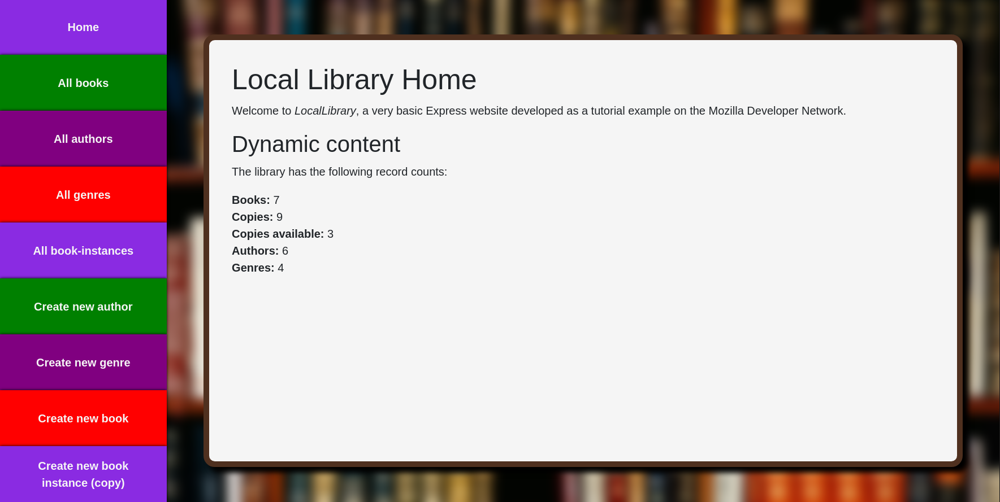
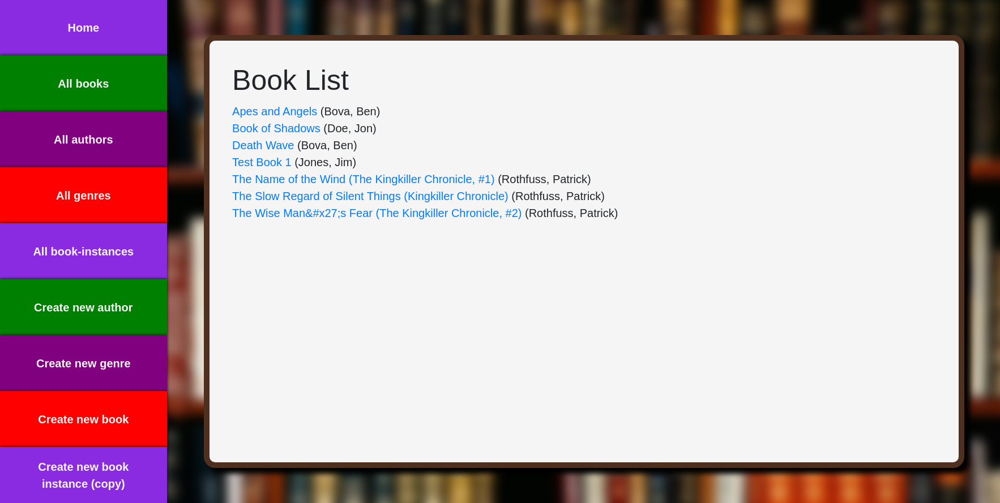
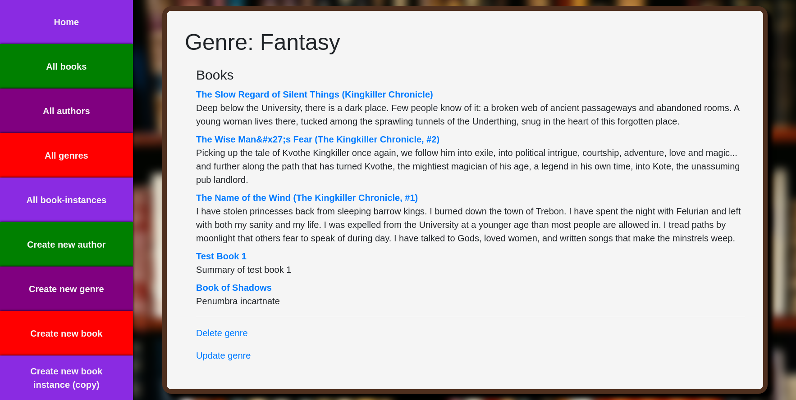
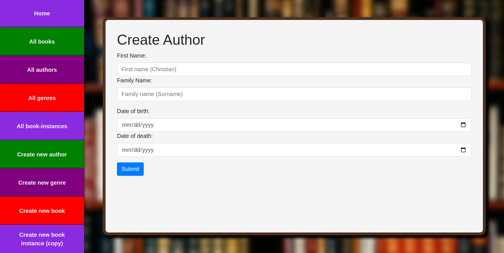
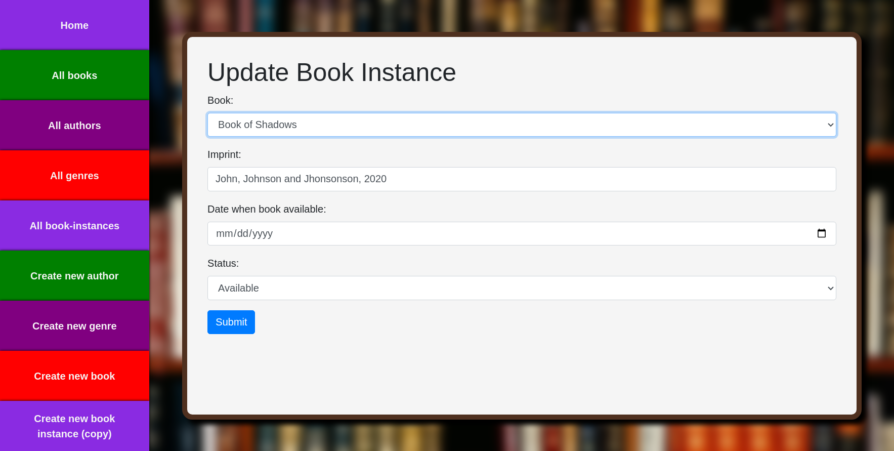
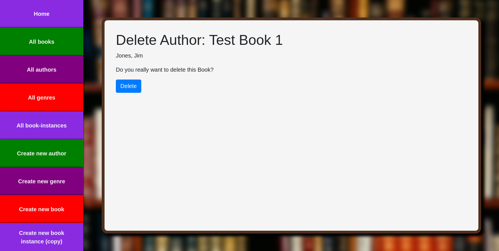

# Project - Express Local Library

This project is a website that provides a catalog for a small local library where users can browse available books, authors, genres and book instances. It was created as practice on using the Express framework, managing a Mongo database, creating models using Mongoose, creating views using Pug and creating controllers to handle requests.

[Checkout the live version here](https://voltaic-grass-city.glitch.me)

## Features

- Routes: The site is structured in different main routes: catalog, books, authors, genres and bookinstances.

  - The catalog route acts as a home page and welcome to users where general information and content of the library is displayed.
  - The books route deals with content related to books
  - The authors route deals with content related to authors
  - The genres routes deals with content related to genres
  - The book instances route deals with content related to book instances (copies)

- NavBar: Users have the ability to navigate through all the items in the library as well as perform operations on them by using the side navigation bar

- Persistent Data: By using a cloud-based database solution, the application can keep track of data being manipulated and allow it to persist

- Operations: Users can create, update and delete entries of any of the routes' content (books, authors, genres and book instances) by using forms to enter the data they want to manipulate in the database

- Validation: The application validates and sanitizes the data entered through the forms to be stored into the database

- Error Handling: The application is able to handle both route and database errors by using middleware and error forwarding

- Responsive: The design of the website is inherently responsive, taking advantage of different viewing sizes to display the content in both aesthetically pleasing and effective ways

## Built using

- NodeJS
- Express + Express Generator
- Express Validator
- Express Async Handler
- MongoDB + Mongoose
- Pug

## Screenshots

Home Page



Book List



Genre - Fantasy



Create Operation for Author



Update Operation for Book Instance



Delete Operation for Book



## Run locally

To setup and work on this project locally:

1. Clone the project

HTTP

```
$ git clone https://github.com/RogerEaux/express-local-library.git
```

SSH

```
$ git clone git@github.com:RogerEaux/express-local-library.git
```

2. Move to the cloned directory

```
cd express-local-library
```

3. Install dependencies

```
npm install
```

4. Start the server

```
npm run devstart
```
